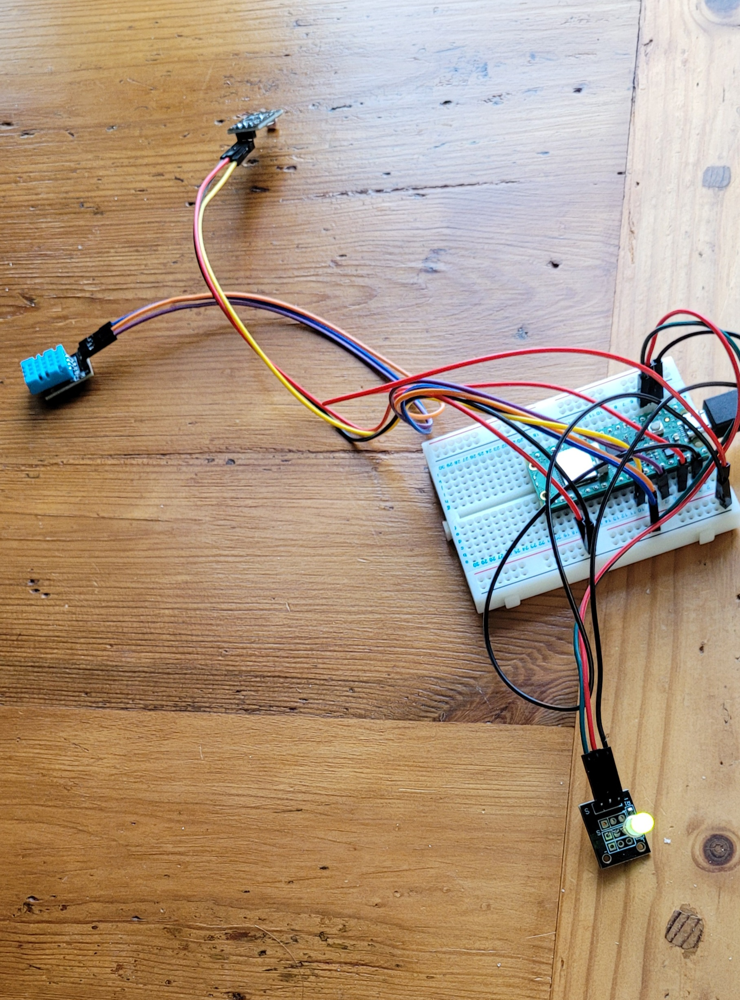

Add: 
Vilken dator och operativsystem jag använder

Author: Hannes Tjulin

This is a tutorial on how to make a plant monitor that both monitors long-term developments in a plant’s climate and can alert when it is time to water the plant. Following this guide should take no more than two hours, provided that all materials are at hand.

**Disclaimer** I am currently still waiting for a cable to connect my soil moisture sensor to the Raspberry Pi. Currently, this device only monitors light intensity, temperature and humidity. When the cable hopefully arrives, I will add the soil sensor to this device.

# Objective
My girlfriend has a large collection of houseplants. While she does not need reminders to water them, I do when she is away. In addition, she has read up on optimal conditions for her plants, but quantifying anything other than temperature requires specialized measuring equipment which we do not have. From these twin needs of long-term measurements and short-term alerts, the idea of this project was born. 

My hope is that the work done in researching and preparing this will enable me to do other projects within IoT. There is also room for improvement in this device, such as making it portable, which I might tackle in some spare time. 

# Material
The following materials are required to make this plant monitor in its most basic form. Everything was bought from [Electrokit](https://www.electrokit.com/).

| Material | Price (SEK) |
| ----------- | ----------- |
| [Raspberry Pi Pico WH](https://www.electrokit.com/raspberry-pi-pico-wh) | 109 |
| [USB Cable A M – micro B M](https://www.electrokit.com/usb-kabel-a-hane-micro-b-5p-hane-1.8m) | 39 |
| [Breadboard](https://www.electrokit.com/kopplingsdack-840-anslutningar) | 69 |
| [Jumper Cables M-M (x)](https://www.electrokit.com/labbsladd-20-pin-15cm-hane/hane) | 29 |
| [Jumper Cables M-F (x)](https://www.electrokit.com/labbsladd-20-pin-15cm-hona/hane) | 29 |
| [JST-PH Cable](https://www.electrokit.com/kabel-med-jst-ph-4-pol-hona-/-0.64mm-stift-200mm) | 24 |
| [Adafruit STEMMA Soil Sensor](https://www.electrokit.com/jordfuktighetssensor-kapacitiv-i2c) | 115 |
| [DHT 11 Humidity and Temperature Sensor](https://www.electrokit.com/digital-temperatur-och-fuktsensor-dht11) |49|
| [Photoresistor Module](https://www.electrokit.com/ljussensor) | 39 |
| [RG LED Module](https://www.electrokit.com/led-modul-rod/gron-5mm) | 19 |
| **TOTAL** | **482** |

The Raspberry Pi is the brain of the device. Variants other than Pico WH may be chosen, but then this guide should not be followed to the letter, as details may differ. Data is sent with the Raspberry Pi’s own Wi-Fi transmitter.

The device has three important sensors: the DHT 11 which measures temperature and humidity, the photoresistor module which measures light intensity and the Adafruit STEMMA soil sensor which measures soil moisture. 

Lastly, some hardware to make everything else work: The USB cable powers everything, the jumper cables connect everything and the breadboard forms a stable base for everything. The JST-PH cable is required for the soil sensor, which does not connect to ordinary jumper cables. A red-green LED has been added to increase the complexity of the project while waiting for the soil sensor.

# Computer setup
This section contains multiple guides, split up into different topics. If you follow these step by step, you should be able to upload all code to your Raspberry Pi.

## Firmware update
First, how to update the firmware on the Raspberry Pi Pico. This is necessary for the Raspberry Pi to be able to run Python code. 

1. Install [Python](https://www.python.org/downloads/) and [VS Code](https://code.visualstudio.com/download) on your computer and make sure that they work using [this guide]( https://code.visualstudio.com/docs/python/python-tutorial) if you don’t have them already. I use VS Code as I am used to it, but other IDE:s such as Thonny are also possible.
2. Open VS Code and install the Pymakr extension. This is done by opening the tab “Extensions” in the left side menu (can also be done with Ctrl+Shift+X), searching for “Pymakr” and clicking “Install”.
3. Update the firmware:
	1. Download the [firmware](https://micropython.org/download/RPI_PICO_W/). Select the latest edition from “Releases”.
	2. Carefully insert the USB-Cable into the Raspberry Pi Pico. It cannot be inserted fully, a small gap will be left. 
	3. Hold down the BOOTSEL button on the Raspberry Pi while inserting the USB Cable into your computer. 
	4. A new drive called RPI-RP2 should open on your computer. Copy/paste the firmware that you downloaded into this drive. Wait until the drive closes down by itself. You should be ready to code now!

All of the steps above are required regardless of what device you want to create with your Raspberry Pi. After they are done, the BOOTSEL button does not need to be pressed and the device can be plugged into your computer normally. What follows are the steps specific to this project. 

## Adafruit preparation
The data will be sent to and visualized in [adafruit](https://io.adafruit.com), so we begin by setting up everything there.

1. Create an account at [this link](https://accounts.adafruit.com/). Log in and click “IO” in the top menu.
2. Go to Feeds >> + New Feed and create four new feeds for the four measurements we will perform: temperature, humidity, light and soil moisture. Name the feeds so that you can tell them apart.
3. In coming steps, you will need your credentials (Username and Active Key). These are found by clicking on the yellow key button next to “+ New Device” in the top right corner. Additionally, you will need the address to your feeds. They are found by going to Feeds >> Selected Feed >> Feed Info >> MQTT by key.

The above steps follow [this guide](https://hackmd.io/@lnu-iot/r1yEtcs55). If anything is unclear, compare with that page.

## Uploading code
Finally, the code will be uploaded to your Raspberry Pi. Every time you change something in the code, for example if you want to connect to a different Wi-Fi network, you will need to redo the following steps.
1. Download the folder “Plant monitor code” from this GitHub page.
2. Open the folder in VS Code by selecting File >> Open Folder and selecting the folder that you downloaded.
3. Change all variables in **lib/keys.py** to line up with your own credentials. Two types of information are needed: password and SSID for your Wi-Fi (make sure that its frequency is 2.4 GHz) and information about your adafruit account. 
4. Go to the PyMakr window in VS Code’s left sidebar. If you have downloaded everything correctly, there should be a project named “Plant Monitor” under the Projects tab. 
	1. Click on “ADD DEVICES” under the project and add the Raspberry Pi. It should be called something like “USB Serial Device (COMx)”, and if you are unsure, detach the USB cable and see what device disappears.
	2. Create a terminal for the Raspberry Pi by hovering over the device and clicking “Create Terminal”. The symbol is “>_”, boxed.
	3. Start development mode for this project by hovering over the projects name and clicking the button that looks like “</>”.
	4. Send the code to the Raspberry Pi by saving (Ctrl + S).
	5. You should get a printout in the terminal saying something like “The temperature is 24 degrees Celsius, the humidity is 50 % and the light is 31.3”. If you get this: good job! The coding part is done for now.  

# Putting everything together
The wiring should be assembled as follows:

The potentials Ground (black cable) and + (red cable) are along the two top strips and provide an operating voltage to all sensors. Data is then transmitted to the relevant pins of the Raspberry Pi through the cables with different colours.

As I only used a small part of the breadboard linked to in materials (and included in the starter kit to this course), I opted to use a smaller breadboard to be able to hide the wiring nicely in a box. 

# Platform
I used adafruit IO as a platform for my data. This is a free-to-use cloud service that centers around “feeds”, being different topics to subscribe to. As it can act both as a MQTT broker receiving data and then can visualize it at the same time, it seemed like the easiest alternative, while being free as well. As I will be the main person to look at the data, I felt no need to put in extra work for fancier visualization of the same data on another site. Additionally, it allows me access to my data while away from my home network, which is nice while away.

# The code
All interesting code is contained in **main.py**. Initially, some pins and variables are defined. **downtime** in particular decides how long the monitor should wait between measurements (in seconds). The LED is set to be turned off, and we try to connect to the Wi-Fi. If this is successful, we turn the light green. In this way, we have an indicator if we are connected or not when we are not plugged into a computer.

Then we enter a while-loop. Every time the loop is entered, we first read all relevant pins, then we do something with the raw data if necessary and lastly we send everything to adafruit IO. If a certain measurement is above/below a certain limit, we can turn the LED light red. When the soil sensor has arrived, this will happen when the moisture is below a predecided threshold.

The folder **lib** contains supportive files that allow **main.py** to function. **keys.py** is perhaps the most important one, as it needs to be edited each time you change Wi-Fi or adafruit setup. **mqtt.py** and **wifiConnection.py** can remain unchanged, as they provide the framework for connectivity. I took them from the course’s [GitHub](https://github.com/iot-lnu/pico-w/tree/main/network-examples) and have not changed anything in them.

# Transmitting the data / connectivity
As alluded to in previous sections, data is transmitted via Wi-Fi using adafruit IO as an MQTT broker. Currently, it sends data every fifth minute, but I see no need to update as frequently when it is deployed in its final state: every hour or so will do.

My initial idea was to use LoRa instead of Wi-Fi to transmit data, as it has several advantages: namely longer range and lower power consumption. This project was however developed away from any preexisting LoRa gateway, and I did not want to create and maintain one for myself as that would cost money. In addition, both low range and high power consumption matter less in this current implementation, as this device will be kept at home plugged into a wall socket and in range of Wi-Fi at all times. The effective range is extended by the adafruit IO solution, as I can access my data from anywhere where I have an internet connection.

# Presenting the data
The data is presented in adafruit’s own dashboard. Its creation is simple: first, log in to adafruit and press IO in the top menu. Then, go to Dashboards >> + New Dashboard and create a new dashboard. Click on it and go to the gearwheel in the top right corner and then “+ Create New Block”. Using this method, create four “Line Chart Blocks”, one for each feed which you should have: temperature, humidity, light and soil moisture. Design the blocks according to your own preferences using the gearwheel in the top right corner.

How long data will be preserved can be decided when creating the blocks, or when editing them. During development, I kept data for 48 hours, but in the final deployment I plan on saving it for longer, likely a week or a month. Long term developments are more interesting to me than to remember how the weather was yesterday!

# Finalizing the design
**This guide is not finalized, as the device it describes is not finished!**
I am currently still waiting for a final cable to arrive. In the meantime, this is as far as I’ve come. This is an image of the device in its current state:

The light is currently green when the temperature is below 28 degrees Celsius, else it turns red. When the cable has arrived, it will be changed to be dependent on soil moisture.

